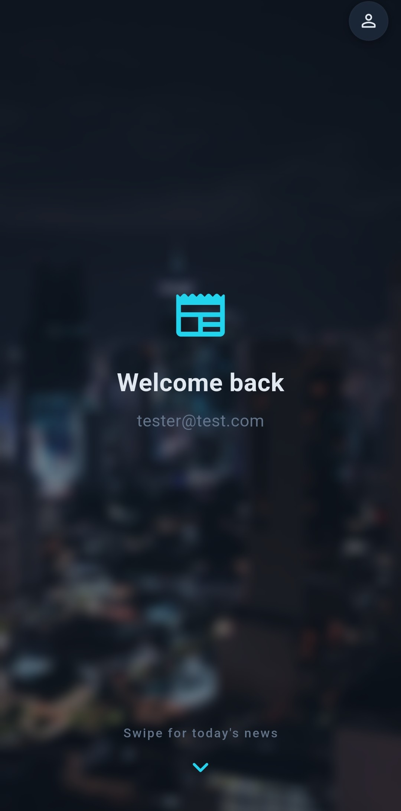

## Sebastien Renault

CS grad '26 from Christopher Newport University. I build things that run: emulators in C++, mobile apps in Flutter, data pipelines in Python.

---

### QuickFeed (CNU 2026 Capstone, People's Choice Award)

Daily news digest app. Pick your topics, get AI summaries with POV labels and sentiment scores each morning.

Built with Flutter and Supabase. GPT-4o-mini handles the summaries. Pipeline fires on Railway every morning.

  
  &nbsp;&nbsp;&nbsp;
  

---

### Other projects

- [GB-Emulator](https://github.com/srenault93/GB-Emulator): Game Boy emulator in C++, with CPU, memory banking, and display.
- [Chip-8-Emulator](https://github.com/srenault93/Chip-8-Emulator): CHIP-8 interpreter in C++. I built this before tackling the Game Boy.
